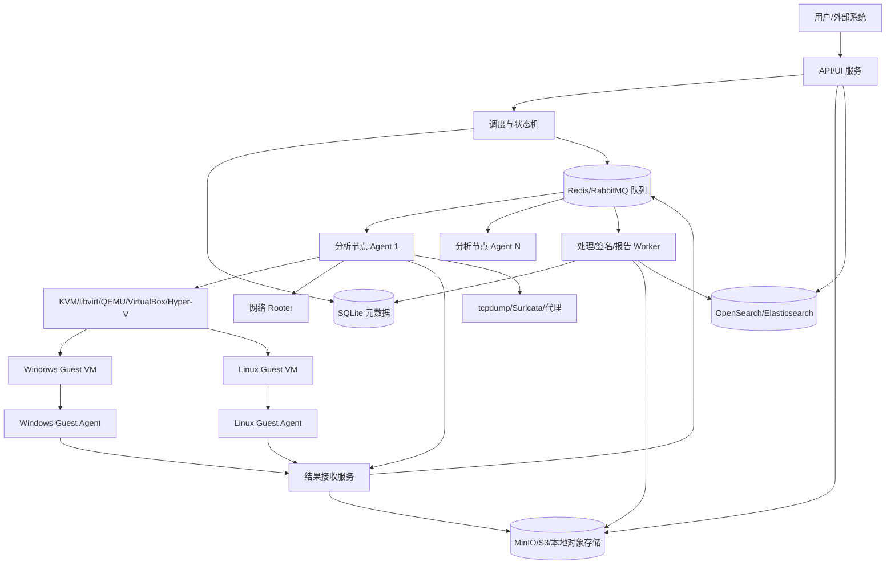
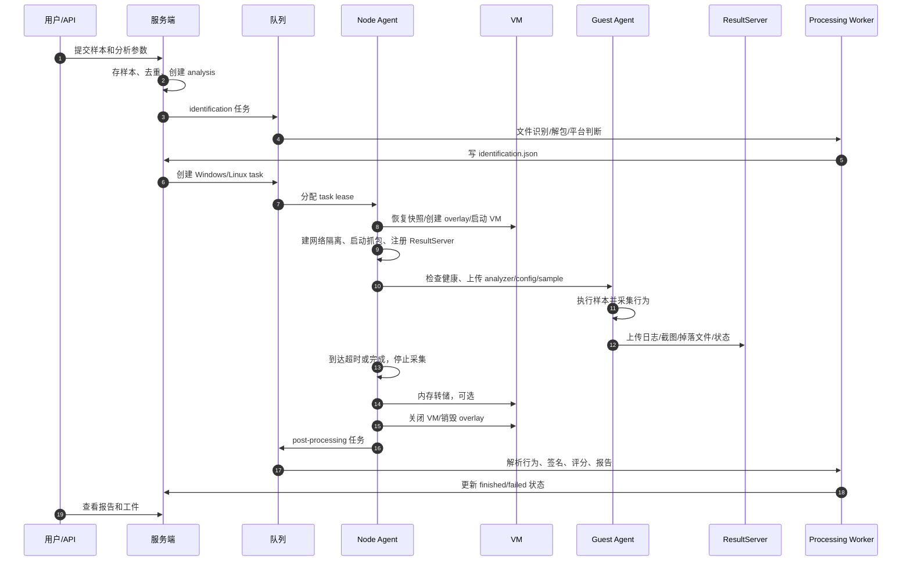

# Windows/Linux 程序动态分析沙箱技术方案

版本：v0.1\
日期：2026-04-25\
适用范围：Windows PE/脚本/文档类样本、Linux ELF/脚本/包类样本的自动化静态与动态分析\
参考项目：`selfproject/Bold-Falcon`、`selfproject/CAPEv2`、`selfproject/cuckoo-2.0.6`、`selfproject/cuckoo3`、`selfproject/drakvuf-sandbox`

## 1. 方案结论

本方案建议实现一个“中心服务端 + 分析节点 Agent + 客体 Guest Agent”的跨平台沙箱系统：

- 中心服务端负责样本提交、任务编排、节点调度、结果索引、报告生成、用户/API 管理。
- 分析节点 Agent 运行在虚拟化宿主机上，负责虚拟机快照恢复、网络隔离、抓包、任务执行生命周期、结果回传。
- Guest Agent 运行在 Windows/Linux 分析虚拟机中，负责接收样本、启动分析器、执行程序、采集客体内证据、上传状态和工件。
- 监控链路采用“宿主侧网络/快照/内存 + 客体侧进程/文件/注册表/系统调用 + 可选 VMI”的组合方式。基础版本依赖 Guest Agent，增强版本可接入 DRAKVUF 类无 Agent VMI 后端。
- 项目实现上不建议直接二次开发某一个老项目，而是吸收参考项目中的稳定模式，重新实现清晰的 Python/Go 架构：服务端与处理插件用 Python，跨平台 Agent 用 Go。

核心设计取舍：

- 先做可用、可维护、可扩展的 Agent 型沙箱，再将无 Agent/VMI 能力作为高隐蔽增强后端。
- Windows 侧以 ETW/Sysmon/Procmon 风格事件、API Hook 可选组件、内存/进程转储为主。
- Linux 侧以 `strace`/auditd/eBPF 分阶段演进，MVP 先保证进程、文件、网络、系统调用基本覆盖。
- 结果存储采用“元数据进入 SQLite，原始工件入对象存储，事件入搜索引擎”的分层方案，避免把大日志塞进数据库文件。
- 所有提交文件及其解包子文件的执行必须发生在 Windows/Linux 分析虚拟机中；服务端、处理 Worker、分析节点宿主机和容器环境只允许读取、传输、解包、静态解析，不允许直接执行样本、脚本、安装包、自解压程序或文档宏。

## 2. 参考项目调研结论

### 2.1 Cuckoo 2.0.6

可复用优点：

- 任务生命周期清晰：提交任务、选择虚拟机、恢复快照、启动 Guest Agent、上传 analyzer、执行样本、ResultServer 收集结果、Processing/Signature/Reporting 生成报告。
- 插件边界成熟：`machinery` 管虚拟化，`packages` 管样本执行方式，`auxiliary` 管抓包/截图等伴随任务，`processing` 管原始结果解析，`signatures` 管行为命中，`reporting` 管报告输出。
- ResultServer 设计有效：客体分析器直接向宿主结果服务上传 BSON 日志、文件、截图等，避免服务端主动拉取大量小文件。
- Guest Agent API 简单：`/status`、`/store`、`/extract`、`/execute`、`/execpy`、`/pinning`、`/kill` 等接口满足基本控制面需求。

不足与规避：

- Python 2 和旧依赖较多，不适合作为新项目底座。
- Windows 监控强依赖老 monitor/hook 链路，维护成本高。
- 调度和处理耦合较重，分布式扩展能力有限。

### 2.2 CAPEv2

可复用优点：

- 在 Cuckoo 基础上增强了恶意载荷提取、动态解包、配置提取、YARA 驱动的行为/内存检测、Suricata、AMSI/ETW 等能力。
- `agent/go` 提供 Go 版 Agent 思路：单文件、零运行时依赖、跨平台构建、可自更新、可加鉴权，比 Python Agent 更适合长期维护。
- ResultServer 增强为 gevent 与多 worker 模式，适合高并发 VM 回传结果。
- Linux analyzer 已有包抽象和 `strace` 思路，可作为 Linux 动态分析的基础参考。
- 网络路由能力比原版更细：支持 drop、internet、VPN、Tor、SOCKS5、INetSim 等路由类型。

不足与规避：

- CAPE 功能强但体系较重，Windows 深度能力和具体 monitor 维护门槛高。
- Linux 支持仍不是主线能力，需要本方案单独强化 Linux 事件采集和报告标准化。

### 2.3 Cuckoo3

可复用优点：

- 架构更现代，拆分为 core、common、processing、machineries、node、web 等包。
- 将处理阶段拆成 identification、pre、post：先识别样本和平台，再做静态预处理，最后处理动态结果。这非常适合 Windows/Linux 多平台任务。
- 配置采用 YAML 和模板，机器配置包含平台、系统版本、架构、Agent 端口、标签、快照、网络接口等信息，便于机器选择。
- 支持分布式 node 概念：中心节点和任务运行节点分离，适合多宿主机横向扩展。
- 建议将复杂结果以 JSON 文件保存在分析目录，中央 SQLite 只记录实体关系，不塞结果大对象。

不足与规避：

- 当前文档中部分能力标注为未完成或未验证，不宜直接依赖。
- 官方说明当前主要面向 Linux 宿主运行 Windows 沙箱，新方案需要补足 Linux 客体分析。

### 2.4 DRAKVUF Sandbox

可复用优点：

- 无 Guest Agent 黑盒分析，通过 VMI/DRAKVUF 插件从虚拟机外观察行为，抗样本检测能力强。
- 插件类型清晰：`apimon`、`filetracer`、`memdump`、`procmon`、`socketmon`、`tlsmon`、`regmon`、`syscalls` 等覆盖 Windows 行为关键面。
- Web 报告结构值得参考：进程树、摘要报告、通用日志、单进程过滤、截图、工件下载。
- 存储可接 S3，队列可用 Redis/RQ，适合大工件场景。
- 网络隔离模型清晰：每个 VM 建独立 bridge，按任务决定是否 NAT 出网，并阻断 VM 间互通。

不足与规避：

- 对硬件、Xen、Intel EPT、符号/profile 要求高，部署和排障复杂。
- 主要优势在 Windows VMI，不能替代 Linux Guest Agent 型采集。
- 本方案将其作为增强后端，而不是 MVP 必需依赖。

### 2.5 Bold-Falcon

可复用优点：

- 在 Cuckoo 模型上加入了检测插件层：`modules/detection` 中有 strings n-gram、MalConv、API stats 等思路。
- 报告和 Web 展示更重视检测结果、威胁分数和模型解释。
- 对辅助模块、机器交互模块、API、提交方式做了较完整中文化说明。

不足与规避：

- Python 2/旧依赖和编码问题明显，不宜直接复用代码。
- ML 模型需要严格版本管理、训练数据治理、阈值评估，否则容易造成不可解释误报。
- 本方案只保留“检测模块插件化”和“模型结果进入报告”的设计思想。

## 3. 建设目标

### 3.1 功能目标

支持以下分析能力：

- Windows 程序：`exe`、`dll`、`msi`、`ps1`、`bat/cmd`、`js/vbs/wsf/hta`、`lnk`、Office/PDF 文档、URL 浏览器访问。
- Linux 程序：ELF 可执行文件、`.so`、shell/python/perl 脚本、`deb/rpm`、`AppImage`、Java/JAR、URL 浏览器访问。
- 静态分析：哈希、文件类型、PE/ELF 元数据、导入导出、节区、证书、字符串、YARA、capa、壳/混淆特征。
- 动态分析：进程树、命令行、文件创建/修改/删除、注册表、服务/计划任务、系统调用/API 调用、网络连接、DNS/HTTP/TLS、截图、内存/进程转储、掉落文件。
- 报告：JSON 机器可读报告、HTML 页面报告、MITRE ATT\&CK 映射、行为签名、威胁评分、工件下载。
- 任务编排：优先级、超时、指定平台/机器/标签、网络路由、重复样本策略、批量提交。
- 分布式：一个中心服务端可管理多个分析节点。

### 3.2 非目标

首版不承诺：

- 绕过所有反沙箱、反虚拟机、反调试样本。
- 让 Guest Agent 完全不可检测。高隐蔽分析由后续 VMI 后端解决。
- 对移动端、macOS 做首期支持。
- 用 ML 结果替代行为签名和人工判读。

硬性安全约束：

- 不在服务端、处理 Worker、Node Agent、Rooter、宿主机 shell、容器或 CI 环境中执行任何用户提交文件及其解包产物。
- 静态分析阶段只能以只读方式解析字节内容，例如哈希、`libmagic`、PE/ELF 元数据、YARA、capa、字符串、压缩包枚举；一旦需要运行文件、触发脚本、打开文档、安装包或访问 URL，必须创建分析任务并在 VM 内执行。

## 4. 总体架构



### 4.1 组件划分

| 组件                | 职责                                      | 推荐技术                      |
| ----------------- | --------------------------------------- | ------------------------- |
| API/UI 服务         | 样本提交、任务查询、报告展示、工件下载、用户/API Key          | FastAPI + Vue/React       |
| Scheduler         | 任务状态机、优先级、节点选择、机器分配、重试                  | Python asyncio + SQLite 事务/队列 |
| Node Agent        | 虚拟化控制、VM 生命周期、网络路由、抓包、结果服务本地协调          | Go 或 Python，优先 Go         |
| Guest Agent       | 客体内文件传输、分析器启动、状态上报、截图/进程控制              | Go 单文件 Agent              |
| Analyzer          | 在 Guest VM 内按平台执行样本并采集行为                  | Python 脚本 + 平台采集器         |
| ResultServer      | 接收日志、文件、截图、内存、PCAP 元数据                  | Go/Python async HTTP/gRPC |
| Processing Worker | 静态/动态结果解析、签名、报告、评分                      | Python 插件                 |
| Rooter            | iptables/nftables、路由、VPN、INetSim、DNS 策略 | 独立最小权限进程                  |
| Storage           | 原始样本、分析目录、工件、报告 JSON                    | MinIO/S3/本地 FS            |
| Search            | 行为事件、IOC、报告字段检索                         | OpenSearch/Elasticsearch  |

### 4.2 三类 Agent

为了避免概念混乱，本文将 Agent 分为两层：

- 分析节点 Agent：运行在宿主机，面向中心服务端注册节点、拉取任务、控制虚拟机。
- Guest Agent：运行在分析虚拟机内，面向节点 Agent 或 ResultServer 提供样本执行控制能力。

对外可以统一称为 Agent，代码仓库中建议明确命名为 `node-agent` 与 `guest-agent`。

## 5. 核心流程

### 5.1 样本分析主流程



### 5.2 任务状态机

| 状态                | 含义                   |
| ----------------- | -------------------- |
| `submitted`       | 样本已提交，尚未识别           |
| `identifying`     | 文件类型、平台、依赖、嵌套压缩包识别中  |
| `waiting_config`  | 可选：等待用户确认目标文件和平台     |
| `queued`          | 已生成 task，等待节点资源      |
| `leasing`         | 节点领取任务并锁定机器          |
| `starting_vm`     | 恢复快照、启动虚拟机           |
| `preparing_guest` | 检测 Agent、上传分析器/样本/配置 |
| `running`         | 样本执行和行为采集中           |
| `collecting`      | 收尾、转储、停止辅助采集         |
| `postprocessing`  | 行为解析、签名、报告生成         |
| `finished`        | 成功完成                 |
| `failed`          | 失败，保留错误信息和已有工件       |
| `cancelled`       | 用户或策略取消              |

状态转换必须持久化，并记录 `started_at`、`ended_at`、`node_id`、`machine_id`、`error_code`、`error_message`。

## 6. 服务端设计

### 6.1 API 模块

核心接口：

| 方法     | 路径                                | 说明                      |
| ------ | --------------------------------- | ----------------------- |
| `POST` | `/api/v1/analyses`                | 提交文件/URL，返回 analysis id |
| `GET`  | `/api/v1/analyses/{id}`           | 查询分析总览                  |
| `GET`  | `/api/v1/analyses/{id}/tasks`     | 查询各平台任务                 |
| `GET`  | `/api/v1/analyses/{id}/report`    | 获取 JSON 报告              |
| `GET`  | `/api/v1/analyses/{id}/artifacts` | 获取工件列表                  |
| `GET`  | `/api/v1/artifacts/{artifact_id}` | 下载工件                    |
| `POST` | `/api/v1/analyses/{id}/cancel`    | 取消分析                    |
| `POST` | `/api/v1/analyses/{id}/rerun`     | 重新分析                    |
| `GET`  | `/api/v1/machines`                | 查看机器池                   |
| `GET`  | `/api/v1/nodes`                   | 查看节点状态                  |
| `WS`   | `/api/v1/analyses/{id}/events`    | 实时状态和日志摘要               |

提交参数建议：

```json
{
  "target_type": "file",
  "platforms": [
    {"os": "windows", "version": "10", "arch": "amd64"},
    {"os": "linux", "version": "ubuntu22.04", "arch": "amd64"}
  ],
  "timeout": 120,
  "priority": 5,
  "network": {"route": "drop"},
  "options": {
    "enforce_timeout": false,
    "memory_dump": false,
    "interactive": false,
    "package": null,
    "arguments": ""
  }
}
```

### 6.2 调度器

调度器参考 Cuckoo/CAPE 的任务管理和 Cuckoo3 的分布式 node 思路，负责：

- 监听新 analysis，推进 identification/pre/post 三阶段。
- 按平台、系统版本、架构、标签、当前负载选择 node 和 machine。
- 使用 lease 机制避免任务被多个节点同时领取。
- 维护机器锁：一台 VM 同一时刻只跑一个任务。
- 处理节点心跳超时、机器启动失败、Guest Agent 不可达、ResultServer 异常等失败。
- 支持任务重试：可换同平台另一台机器，超过次数后标记 failed。

调度策略：

- 默认按 priority 降序、submitted\_at 升序。
- 支持 machine tags，例如 `office2019`、`pdfreader`、`browser_edge`、`dotnet48`、`python3`、`glibc_2_35`。
- 支持 platform fallback：未识别平台时，可按策略默认跑 Windows 和 Linux。
- 支持资源水位：磁盘、内存、CPU、网络出口异常时暂停分配。

### 6.3 数据库模型

SQLite 只存元数据和索引，不存大型原始日志。数据库文件建议启用 WAL 模式，并由中心服务端统一访问；分析节点不直接写 SQLite，而是通过 API/队列回传状态，避免多节点文件锁和网络文件系统一致性问题。

SQLite 使用建议：

- 数据库文件放在中心服务端本地 SSD，例如 `/var/lib/diting-sandbox/metadata.sqlite3`。
- 启用 `PRAGMA journal_mode=WAL`、`PRAGMA foreign_keys=ON`、`PRAGMA busy_timeout=5000`。
- 服务端写入通过短事务完成，调度 lease 使用事务和唯一约束实现。
- 行为事件、原始日志、PCAP、截图、内存 dump 不进入 SQLite，只保存对象存储 key 和摘要。
- 如果后续规模超过 SQLite 单写入能力，再评估迁移到外部关系型数据库；当前方案按 SQLite 实现。

主要表：

| 表           | 关键字段                                                                                                         |
| ----------- | ------------------------------------------------------------------------------------------------------------ |
| `samples`   | `id`, `sha256`, `sha1`, `md5`, `size`, `filename`, `mime`, `storage_key`                                     |
| `analyses`  | `id`, `sample_id`, `status`, `submitter`, `settings_json`, `created_at`, `updated_at`                        |
| `tasks`     | `id`, `analysis_id`, `platform`, `os_version`, `arch`, `status`, `node_id`, `machine_id`, `timeout`, `route` |
| `nodes`     | `id`, `name`, `api_addr`, `status`, `capabilities_json`, `last_seen_at`                                      |
| `machines`  | `id`, `node_id`, `name`, `platform`, `os_version`, `arch`, `ip`, `tags_json`, `state`                        |
| `artifacts` | `id`, `analysis_id`, `task_id`, `type`, `name`, `storage_key`, `size`, `sha256`                              |
| `reports`   | `analysis_id`, `report_key`, `score`, `family`, `tags_json`, `created_at`                                    |
| `errors`    | `id`, `analysis_id`, `task_id`, `component`, `code`, `message`, `trace_key`                                  |

行为事件量大时进入 OpenSearch：

```json
{
  "analysis_id": "20260425-ABC123",
  "task_id": 42,
  "platform": "windows",
  "timestamp": "2026-04-25T13:05:31.456Z",
  "event_type": "file",
  "action": "write",
  "pid": 3120,
  "ppid": 884,
  "process_name": "sample.exe",
  "object": "C:\\Users\\user\\AppData\\Roaming\\x.dat",
  "result": "success",
  "details": {}
}
```

### 6.4 存储目录

对象存储 key 结构：

```text
samples/sha256/ab/cd/<sha256>
analyses/YYYYMMDD/<analysis_id>/analysis.json
analyses/YYYYMMDD/<analysis_id>/tasks/<task_id>/task.json
analyses/YYYYMMDD/<analysis_id>/tasks/<task_id>/logs/events.jsonl.zst
analyses/YYYYMMDD/<analysis_id>/tasks/<task_id>/logs/analyzer.log
analyses/YYYYMMDD/<analysis_id>/tasks/<task_id>/pcap/dump.pcap
analyses/YYYYMMDD/<analysis_id>/tasks/<task_id>/screenshots/0001.jpg
analyses/YYYYMMDD/<analysis_id>/tasks/<task_id>/files/<sha256>_<name>
analyses/YYYYMMDD/<analysis_id>/tasks/<task_id>/memory/memory.dmp.zst
analyses/YYYYMMDD/<analysis_id>/report.json
analyses/YYYYMMDD/<analysis_id>/report.html
```

每个任务目录保留：

- `task.json`：任务配置、机器、网络、时间线。
- `events.jsonl.zst`：统一事件流。
- `raw/`：原始工具输出，如 `strace`、ETW、Procmon、Sysmon、DRAKVUF logs。
- `artifacts/`：截图、pcap、TLS key、内存、掉落文件。
- `errors/`：组件错误和异常堆栈。

## 7. 分析节点 Agent 设计

### 7.1 职责

Node Agent 是分析节点的本地控制面：

- 向服务端注册节点和机器池。
- 心跳上报 CPU、内存、磁盘、可用机器、运行任务数。
- 接收或拉取任务 lease。
- 控制虚拟机恢复快照、启动、暂停、关机、销毁 overlay。
- 启动每任务网络隔离、NAT/drop/VPN/INetSim。
- 启动 tcpdump、Suricata、MITM/PolarProxy 可选组件。
- 启动本地 ResultServer 或注册中心 ResultServer。
- 与 Guest Agent 通信，上传 analyzer、样本和配置。
- 收尾时转储内存、拉取缺失文件、停止采集、清理网络规则。

### 7.2 虚拟化抽象

参考 Cuckoo/CAPE `machinery` 和 Cuckoo3 machinery manager，定义统一接口：

```python
class Machinery:
    name: str

    def load_machines(self) -> list[Machine]:
        ...

    def restore_start(self, machine: Machine, task: Task) -> None:
        ...

    def stop(self, machine: Machine) -> None:
        ...

    def state(self, machine: Machine) -> str:
        ...

    def dump_memory(self, machine: Machine, output_path: str) -> None:
        ...

    def screenshot(self, machine: Machine, output_path: str) -> None:
        ...

    def cleanup(self, machine: Machine, task: Task) -> None:
        ...
```

首期后端：

- Linux 宿主：KVM/libvirt/QEMU，推荐作为 MVP。
- 可选兼容：VirtualBox、VMware、Proxmox。
- Windows 宿主：Hyper-V 作为后续扩展，不作为 MVP。

KVM/QEMU 机器配置：

```yaml
machines:
  win10-01:
    platform: windows
    os_version: "10"
    architecture: amd64
    ip: 192.168.30.11
    agent_port: 8000
    qcow2_path: /srv/sandbox/vms/win10-01/disk.qcow2
    snapshot_path: /srv/sandbox/vms/win10-01/memory.snapshot
    interface: br-sbx
    tags: [office2019, edge, dotnet48, pdfreader]
  ubuntu22-01:
    platform: linux
    os_version: "22.04"
    architecture: amd64
    ip: 192.168.31.11
    agent_port: 8000
    qcow2_path: /srv/sandbox/vms/ubuntu22-01/disk.qcow2
    snapshot_path: /srv/sandbox/vms/ubuntu22-01/memory.snapshot
    interface: br-sbx
    tags: [python3, bash, glibc_2_35]
```

### 7.3 网络 Rooter

每个任务创建独立网络上下文：

- 默认 `drop`：允许 VM 访问 ResultServer/DNS/DHCP，禁止出互联网。
- `internet`：通过指定出口 NAT 出网。
- `vpn`：通过指定 VPN/国家出口。
- `inetsim`：DNS/HTTP/SMTP 等协议重定向到仿真服务。
- `mitm`：HTTP/HTTPS 代理和 TLS 证据收集，可选。

Rooter 需要独立进程和最小权限：

- Node Agent 不直接以 root 长期运行。
- 网络规则通过 Unix socket/gRPC 调用 Rooter。
- Rooter 命令白名单化，例如 `enable_drop(task_id, vm_ip, resultserver_ip)`。
- 收尾必须幂等，即重复 disable 不报错。

基础规则：

- 禁止 VM 间互通。
- 禁止 VM 访问宿主非沙箱服务端口。
- 允许 DHCP/DNS/ResultServer。
- 对外访问按任务路由策略放行。
- 记录所有网络规则变更到 `task.json`。

## 8. Guest Agent 设计

### 8.1 技术选择

Guest Agent 采用 Go 实现：

- 编译为 Windows/Linux 单文件，减少 Python 运行时依赖。
- 支持 32 位和 64 位 Windows 构建。
- 便于做自更新、鉴权、TLS、并发上传。
- 可根据 CAPEv2 Go Agent 思路兼容 Python Agent 的核心 API。

Agent 只运行在分析虚拟机快照中，不在宿主机运行不可信样本。

### 8.2 安全模型

Agent 风险很高，必须限制暴露面：

- 仅监听 host-only 网卡地址，默认 `0.0.0.0:8000` 只在隔离网络可达。
- 任务开始后执行 pinning，只接受 Node Agent/ResultServer IP。
- 每个任务使用一次性 token 或 mTLS client cert。
- 所有文件写入路径必须做路径穿越校验，禁止 `../`、绝对路径越权、符号链接逃逸。
- 上传大小、单文件数量、总工件大小都要有限制。
- `/execute` 必须要求 task token，命令参数由 Node Agent 生成，不暴露给外部用户直接调用。
- 分析结束后 Agent 状态重置，VM 回滚快照。

### 8.3 Agent API

建议内部使用 gRPC；为了调试和兼容，也可以提供 HTTP 版本。

核心接口：

| 接口                 | 说明                     |
| ------------------ | ---------------------- |
| `GET /`            | 返回版本、平台、特性             |
| `GET /status`      | 当前任务状态                 |
| `POST /status`     | 更新状态，通常由 analyzer 调用   |
| `GET /system`      | OS、架构、主机名、用户           |
| `GET /environ`     | 环境变量                   |
| `POST /store`      | 上传样本或配置到客体             |
| `POST /extract`    | 上传并解压 analyzer zip     |
| `POST /execute`    | 执行命令                   |
| `POST /execpy`     | 执行 Python analyzer，可选  |
| `POST /retrieve`   | 从客体取回文件                |
| `POST /push`       | 客体主动推送文件到 ResultServer |
| `POST /screenshot` | 截图                     |
| `POST /processes`  | 获取进程列表                 |
| `POST /kill`       | 停止 Agent 或当前分析         |
| `POST /update`     | Agent 自更新，受控开启         |
| `POST /pinning`    | 锁定控制端 IP               |

### 8.4 Guest Analyzer 包

Analyzer 不应写死执行逻辑，采用 package 插件：

```python
class Package:
    name = "generic"
    platform = "windows"

    def prepare(self, context):
        pass

    def start(self, context) -> list[int]:
        raise NotImplementedError

    def check(self, context) -> bool:
        return True

    def finish(self, context):
        pass

    def collect(self, context) -> list[Artifact]:
        return []
```

Windows packages：

- `exe`：普通 PE 执行。
- `dll`：`rundll32`/导出函数调用。
- `msi`：`msiexec /i`。
- `ps1`：PowerShell，支持 bypass 参数但默认记录。
- `office`：Word/Excel 打开文档并启用宏分析环境。
- `pdf`：指定 PDF 阅读器。
- `browser`：Edge/Chrome/IE 访问 URL。
- `archive`：解压后选择目标文件。

Linux packages：

- `elf`：加执行权限后运行。
- `shared_object`：通过 loader 或测试 harness 加载。
- `bash`、`python`、`perl`、`node`：脚本运行。
- `deb`、`rpm`：仅在 Linux VM 的 disposable overlay 或 VM 内临时 root 中安装执行，默认谨慎开启；禁止在宿主机、服务端容器或处理 Worker 中安装/执行。
- `jar`：Java 运行。
- `browser`：Firefox/Chromium 访问 URL。
- `archive`：解包后选择目标文件。

## 9. Windows 动态分析设计

### 9.1 MVP 采集方式

首期优先稳定：

- 进程：ETW Kernel Process 或 Sysmon，记录创建/退出/命令行/父子关系。
- 文件：Sysmon/ETW FileIO，辅以分析前后目录 diff。
- 注册表：Sysmon/ETW Registry 或轻量 registry diff。
- 网络：宿主侧 tcpdump 生成 PCAP，客体侧记录连接进程映射。
- DNS/HTTP：PCAP 解析、代理日志、Windows DNS ETW 可选。
- 截图：Guest Agent 定时截图。
- 掉落文件：文件事件命中后由 Agent 或 analyzer 上传。
- 内存：任务结束时可选 full memory dump；进程级 dump 可用 Procdump/DbgHelp MiniDumpWriteDump。

### 9.2 增强采集方式

第二阶段加入：

- CAPE 风格 API monitor DLL：捕获高价值 WinAPI，如进程注入、注册表、文件、网络、加解密、反调试。
- AMSI/ETW：脚本和 PowerShell 内容采集。
- YARA 触发转储：对内存区域或解包 payload 做 YARA 扫描，命中后转储。
- TLS key：浏览器或进程环境支持时采集 TLS master secret。
- 用户模拟：鼠标移动、点击、键盘输入，减少静默样本。
- 交互桌面：VNC/Guacamole/noVNC，仅允许授权分析员访问。

### 9.3 可选 VMI 后端

对高对抗样本可接入 DRAKVUF 型后端：

- 无 Guest Agent 执行监控。
- 使用 VMI 插件采集进程、文件、注册表、socket、TLS、API。
- 通过 injector 或短生命周期 helper 完成样本投递和执行，执行动作仍发生在分析 VM 内。
- 该后端部署复杂，应作为独立 `machinery/monitor` 能力，不影响常规任务。

## 10. Linux 动态分析设计

### 10.1 MVP 采集方式

Linux 首期目标是完整可用：

- 执行器：Guest Analyzer 以受控用户运行样本，记录 cwd/env/argv。
- 系统调用：`strace -ff -ttt -s 4096 -yy -o raw/strace` 跟踪子进程。
- 进程树：周期性读取 `/proc`，记录 PID/PPID/cmdline/exe/cwd/environ hash。
- 文件：解析 `open/openat/creat/unlink/rename/chmod/chown` 等 syscall，辅以目录快照 diff。
- 网络：宿主侧 tcpdump，客体侧解析 `/proc/net/tcp*`、`ss -pant`，strace 解析 `connect/sendto/recvfrom`。
- 内存：按需读取 `/proc/<pid>/maps` 与 `/proc/<pid>/mem`，限制大小。
- 截图：桌面类样本使用 X11/Wayland 工具，服务器类样本可不截图。
- 掉落文件：根据文件事件和 diff 上传。

### 10.2 增强采集方式

第二阶段加入：

- eBPF collector：基于 tracepoint/kprobe 捕获 exec、open、connect、dns、file write 等事件，降低 strace 对样本行为的影响。
- auditd fallback：对不支持 eBPF 的内核提供审计规则。
- fanotify/inotify：实时文件变更。
- seccomp notify：高级受控执行，适合研究型策略。
- 容器辅助环境：仅用于运行受信处理插件和静态工具，不用于执行提交文件或解包子文件；任何样本、脚本、安装包、文档宏、自解压程序的执行仍必须进入 VM。

### 10.3 Linux 事件归一化

strace/eBPF/auditd 统一映射为同一事件模型：

| Linux 来源               | 统一事件                         |
| ---------------------- | ---------------------------- |
| `execve`               | `process.create`             |
| `clone/fork/vfork`     | `process.fork`               |
| `open/openat/creat`    | `file.open/create`           |
| `write/pwrite`         | `file.write`                 |
| `unlink/unlinkat`      | `file.delete`                |
| `rename/renameat`      | `file.rename`                |
| `connect`              | `network.connect`            |
| `bind/listen/accept`   | `network.listen/accept`      |
| `chmod/chown/setxattr` | `file.metadata`              |
| `ptrace`               | `process.injection_or_debug` |

## 11. 静态识别与预处理

参考 Cuckoo3 identification/pre 思路，提交后先做轻量识别：

- 计算 MD5/SHA1/SHA256/SHA512、ssdeep/TLSH。
- `libmagic` 判定类型。
- 解压 zip/rar/7z/tar/gz，处理嵌套压缩包，限制层级和总大小。
- 解包过程只允许调用受信解压工具读取归档结构和释放文件，不允许运行归档内文件、自解压程序、安装器或文档宏；需要触发执行时必须进入 VM。
- PE：pefile/LIEF，提取导入表、导出表、节区、签名、版本信息、imphash、pdb、overlay。
- ELF：pyelftools/LIEF，提取架构、入口、section、dynamic symbols、rpath、interpreter、packed 痕迹。
- 脚本：语言识别、混淆特征、URL/IP/命令提取。
- YARA：静态规则命中。
- capa：能力识别。
- safelist：已知良性、系统组件、过小文件、无执行价值文件过滤。

识别输出 `identification.json`：

```json
{
  "selected": true,
  "target": {
    "type": "file",
    "name": "sample.exe",
    "sha256": "...",
    "file_type": "PE32+ executable",
    "platforms": ["windows"],
    "arch": "amd64"
  },
  "dependencies": ["dotnet48"],
  "ignored": [],
  "children": []
}
```

## 12. 结果处理与报告

### 12.1 处理阶段

处理 Worker 分三类：

- Identification Worker：快速识别样本、选平台、解包。
- Pre Worker：重型静态分析、YARA/capa、归一化目标。
- Post Worker：动态日志解析、行为聚合、签名、评分、报告。

每个处理插件独立：

```python
class ProcessingPlugin:
    key = "network"
    stage = "post"
    order = 100

    def run(self, context) -> dict:
        ...
```

### 12.2 报告结构

`report.json` 顶层结构：

```json
{
  "info": {},
  "target": {},
  "score": 0,
  "verdict": "unknown",
  "signatures": [],
  "mitre_attack": [],
  "static": {},
  "behavior": {
    "process_tree": [],
    "summary": {},
    "events_count": {}
  },
  "network": {},
  "dropped": [],
  "memory": {},
  "detections": [],
  "artifacts": [],
  "errors": []
}
```

### 12.3 行为签名

签名参考 Cuckoo/CAPE 的方式，但增加结构化字段：

```python
class Signature:
    name = "persistence_run_key"
    platform = "windows"
    severity = 3
    confidence = 80
    mitre = ["T1060", "T1547.001"]

    def match(self, report, events) -> list[Finding]:
        ...
```

评分建议：

- `severity` 表示行为危害，1 到 5。
- `confidence` 表示规则置信度，0 到 100。
- 总分由最高严重度、命中数量、证据置信度、静态检测、网络 IOC 综合计算。
- 报告中必须显示证据，不只显示分数。

### 12.4 ML 检测层

参考 Bold-Falcon 的检测模块，但做工程约束：

- ML 模型作为 `detections` 插件，不直接覆盖 verdict。
- 每个模型记录版本、训练数据日期、特征版本、阈值、输入摘要。
- 支持静态模型：MalConv、strings n-gram、PE 特征。
- 支持动态模型：API/syscall 序列、行为统计。
- 模型输出必须可解释：关键特征、触发行为类别、置信度。

## 13. ResultServer 设计

ResultServer 负责接收客体或节点上传：

- 事件流：JSONL/gRPC stream，按任务写入 `events.jsonl.zst`。
- 文件工件：截图、掉落文件、内存、日志、TLS key。
- 状态消息：running、complete、exception、heartbeat。
- 大文件断点和限流：避免单任务打满磁盘。

上传协议必须校验：

- task id 与 token 是否匹配。
- 来源 IP 是否是任务绑定 VM。
- 上传路径是否属于允许目录。
- 单文件和总大小是否超限。
- 同名可替换文件和追加文件分开处理。

建议 ResultServer 与 Node Agent 同节点部署，减少跨网络传输；处理完成后异步上传对象存储。

## 14. 配置设计

配置目录借鉴 Cuckoo3 的 CWD：

```text
/etc/diting-sandbox/
  server.yaml
  node.yaml
  machineries/
    qemu.yaml
  analysissettings.yaml
  routing.yaml
  processing.yaml
  reporting.yaml
  signatures/
  yara/
  agent/
    guest-agent-windows-amd64.exe
    guest-agent-linux-amd64
```

`analysissettings.yaml`：

```yaml
limits:
  max_timeout: 600
  max_file_size: 4294967296
  max_platforms: 4

default:
  timeout: 120
  priority: 1
  network:
    route: drop
  memory_dump: false
  enforce_timeout: false

platform:
  fallback_platforms:
    - windows
    - linux
  versions:
    windows: ["10", "11"]
    linux: ["ubuntu22.04", "ubuntu24.04"]
```

`routing.yaml`：

```yaml
routes:
  drop:
    enabled: true
  internet:
    enabled: false
    interface: eth1
    routing_table: main
  inetsim:
    enabled: false
    server: 192.168.50.10
  vpn:
    enabled: false
    providers: {}
```

## 15. 安全与隔离要求

宿主机安全：

- 沙箱宿主机独立部署，不接入办公内网。
- 禁用 VM shared clipboard、shared folder、drag-drop。
- VM 磁盘使用只读 base + 每任务 disposable overlay。
- 样本和工件目录禁用自动执行、禁用索引器打开样本。
- 服务端、处理 Worker、Node Agent、Rooter、宿主机 shell 和容器环境禁止执行任何提交文件及其解包产物；所有文件执行动作必须通过调度器创建任务，在 VM 内由 Guest Analyzer 或 VMI injector 完成。
- Node Agent 非 root 运行，Rooter 单独最小权限。
- 管理面 API 强制认证，生产环境强制 TLS。

网络安全：

- 默认无互联网。
- 明确任务申请才允许 internet/vpn。
- DNS 默认进入沙箱 DNS 或 INetSim。
- 阻断 VM 到宿主非必要端口。
- 阻断 VM 到 VM。
- 对外流量可限速、记录、按任务隔离。

样本安全：

- 所有下载接口需要权限控制和审计。
- 报告中的字符串、HTML、URL 必须转义，避免 XSS。
- 压缩包解压必须限制层级、总大小、路径穿越。
- 服务端静态分析只能读取样本字节，不得为了识别类型而运行脚本、宏、安装器、自解压文件或二进制。
- YARA/签名/插件作为受信代码管理，不允许普通用户上传任意 Python 插件直接执行。

## 16. 部署方案

### 16.1 单节点 MVP

推荐环境：

- 宿主 OS：Ubuntu Server 24.04 LTS。
- 虚拟化：KVM/libvirt/QEMU。
- 数据库：SQLite 3，启用 WAL 模式，数据库文件放在中心服务端本地磁盘。
- 队列：Redis 7 或 RabbitMQ。
- 对象存储：MinIO，开发环境可用本地文件系统。
- 搜索：OpenSearch，可在 MVP 后半段接入。
- 网络工具：tcpdump、Suricata、dnsmasq、iptables/nftables。

VM 模板：

- Windows 10/11 x64：安装 Guest Agent、自启动、关闭更新、固定 IP、常用运行库、Office/PDF/浏览器按标签区分。
- Ubuntu 22.04/24.04 x64：安装 Guest Agent、自启动、固定 IP、strace、python3、常见解释器。
- 每台 VM 保存 clean snapshot，验证恢复后 Agent 端口可达。

### 16.2 分布式部署

```text
中心服务端：
  api-server
  scheduler
  processing-workers
  sqlite metadata db
  redis/rabbitmq
  minio/s3
  opensearch

分析节点：
  node-agent
  rooter
  resultserver
  libvirt/qemu
  vm pool
```

节点启动后上报：

- node 名称和版本。
- 机器池清单。
- 支持平台、系统版本、架构。
- 网络路由能力。
- 可用磁盘、内存、CPU。
- 当前运行任务。

## 17. 项目目录建议

```text
diting-sandbox/
  server/
    app/
      api/
      scheduler/
      models/
      services/
      auth/
  node-agent/
    cmd/node-agent/
    pkg/machinery/
    pkg/rooter/
    pkg/resultserver/
  guest-agent/
    cmd/guest-agent/
    pkg/platform/windows/
    pkg/platform/linux/
    pkg/protocol/
  analyzer/
    common/
    windows/
      packages/
      collectors/
    linux/
      packages/
      collectors/
  processing/
    identification/
    pre/
    post/
    signatures/
    reporting/
    detections/
  configs/
    templates/
  deploy/
    docker-compose.yml
    systemd/
    ansible/
  docs/
```

## 18. 里程碑

### M1：单节点可跑通

交付：

- API 提交文件。
- SQLite/对象存储基础模型。
- Node Agent 控制 KVM 恢复和关闭 VM。
- Go Guest Agent 支持 health/store/extract/execute/status/upload。
- Windows `exe` 和 Linux `elf` generic package。
- 宿主 tcpdump 抓包。
- 基础 JSON 报告：进程、文件、网络、截图、日志。

验收：

- 提交 Windows exe 能得到进程树、PCAP、截图、掉落文件。
- 提交 Linux ELF 能得到 `strace` 事件、进程树、PCAP。
- VM 每次任务后回滚到干净快照。
- 验证服务端、处理 Worker、Node Agent 和宿主机不会执行提交文件；Windows/Linux 文件执行只发生在对应分析 VM 内。

### M2：处理和报告完善

交付：

- identification/pre/post Worker。
- PE/ELF 静态解析、YARA、capa。
- PCAP 解析、DNS/HTTP/连接聚合。
- 行为事件归一化。
- 签名引擎和威胁评分。
- Web 报告页面。

验收：

- 报告能按进程查看文件/网络/注册表或 syscall。
- 签名命中有证据和 MITRE 映射。

### M3：增强监控

交付：

- Windows ETW/Sysmon collector。
- Linux eBPF collector PoC。
- 内存/进程 dump。
- Suricata。
- TLS key/代理能力可选。
- 交互桌面可选。

验收：

- Windows 常见持久化、进程注入、网络行为能稳定识别。
- Linux 文件写入、反调试、网络连接、子进程链路能稳定识别。

### M4：分布式和高隐蔽后端

交付：

- 多节点调度。
- 节点故障转移和任务重试。
- DRAKVUF/VMI 后端 PoC。
- S3 长期存储和冷热数据清理。
- ML 检测插件。

验收：

- 多节点并发任务不重复分配。
- 节点离线后任务可恢复或失败可解释。
- VMI 后端可对指定 Windows 样本生成基础进程/文件/网络报告。

## 19. 主要风险与缓解

| 风险                   | 影响        | 缓解                                       |
| -------------------- | --------- | ---------------------------------------- |
| Guest Agent 被样本检测    | 样本不执行真实行为 | 随机化 Agent 名称/路径，减少暴露；高风险样本走 VMI 后端       |
| Windows API Hook 不稳定 | 崩溃或行为丢失   | MVP 先用 ETW/Sysmon/Procmon，Hook 作为增强组件    |
| Linux strace 改变样本时序  | 影响对抗样本行为  | 后续引入 eBPF/auditd，strace 作为基础模式           |
| 工件体积过大               | 磁盘耗尽、报告慢  | 单任务配额、压缩、对象存储、内存 dump 默认关闭               |
| 网络误放行                | 恶意流量出网    | 默认 drop，路由白名单，Rooter 审计，出口隔离             |
| VM 污染未回滚             | 后续分析不可信   | disposable overlay、快照健康检查、每任务校验 Agent 状态 |
| 插件执行任意代码             | 服务端被攻击    | 插件只允许管理员部署，处理 Worker 容器隔离                |

## 20. 技术选型建议

| 层           | 选型                                   | 理由                                   |
| ----------- | ------------------------------------ | ------------------------------------ |
| 服务端 API     | FastAPI                              | 类型清晰、异步、易写 OpenAPI                   |
| 调度/处理       | Python                               | 生态适合样本解析、YARA、capa、pefile、pyelftools |
| Node Agent  | Go                                   | 单文件部署、并发好、便于系统调用封装                   |
| Guest Agent | Go                                   | 跨平台、零依赖、可自更新                         |
| 虚拟化         | KVM/libvirt/QEMU                     | Linux 宿主稳定、快照和网络可控                   |
| 队列          | Redis Streams/RQ 或 RabbitMQ          | 任务分发、Worker 解耦                       |
| 元数据         | SQLite 3 + WAL                       | 部署简单、单节点中心服务足够可靠，元数据轻量，后续可迁移      |
| 工件          | MinIO/S3                             | 大文件、冷热分层、横向扩展                        |
| 搜索          | OpenSearch                           | 行为事件和 IOC 检索                         |
| 网络分析        | tcpdump + Suricata                   | 成熟、可解释                               |
| 静态分析        | YARA + capa + LIEF/pefile/pyelftools | 恶意代码分析生态成熟                           |

## 21. MVP 验收清单

- 服务端可以提交文件并返回 analysis id。
- 服务端可以按 analysis id 查询状态、报告、工件。
- Node Agent 可以注册节点、上报机器、领取任务。
- Windows 和 Linux Guest Agent 都能自启动并响应 health。
- Windows VM 能执行 exe，Linux VM 能执行 ELF。
- 所有提交文件、解包子文件、脚本、安装包和文档宏的执行都只发生在 VM 内，宿主机和服务端组件仅做只读静态解析与文件传输。
- 任务完成后能生成 `report.json`。
- 至少包含：进程树、网络 PCAP、DNS/连接摘要、文件变更、截图、原始日志。
- 每次任务后 VM 回滚，第二次任务不受第一次污染。
- 默认网络为 drop，只有 ResultServer/DNS/DHCP 可达。
- 单任务工件大小有上限，超限会记录错误而不是拖垮节点。
- 分析失败时报告能说明失败组件和原因。

## 22. 后续深化方向

- Windows：CAPE 风格动态解包、AMSI/ETW 深度脚本采集、YARA 触发内存 dump、配置提取器框架。
- Linux：eBPF CO-RE collector、容器逃逸/提权行为识别、内核模块/LD\_PRELOAD 检测。
- VMI：DRAKVUF 后端、agentless 模式、profile 管理、符号自动化。
- 报告：行为时间线、进程单页视图、IOC 导出、STIX/MISP、ATT\&CK Navigator layer。
- 运营：样本去重、批量分析、任务配额、用户隔离、审计日志、冷热数据清理。
- 检测：签名市场、模型版本治理、误报反馈闭环。
